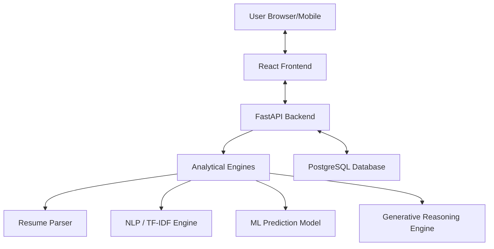

# System Architecture – ResumeXAI 2.0 🏗️

ResumeXAI 2.0 utilizes a modern, professional full-stack architecture designed for high-performance AI-driven resume analysis. The system follows a **client-server architecture** organized into three primary layers, ensuring modularity, security, and scalability.

- **Presentation Layer (Frontend)**: A highly responsive React SPA tailored for seamless interaction across all device sizes.
- **Application Layer (Backend APIs)**: A FastAPI orchestrator that manages long-term session persistence, file processing, and service coordination.
- **Data & Intelligence Layer (Database + ML + AI)**: The persistent storage and advanced analytical engines (NLP, Logistic Regression, and LLMs).

---

# High-Level Architecture

The following diagram illustrates the high-level interaction between system components:

The backend orchestrates all analytical modules, aggregates the intelligence, and returns a structured JSON evaluation report to the frontend dashboard.

---

# Frontend Architecture

**Technology Stack:** React (Vite) + Tailwind CSS + Framer Motion (Animations) + Recharts + jsPDF

### Key Components:
- **Auth Module**: Secure Login and Registration pages (including Google OAuth integration) with `localStorage` based long-term session persistence.
- **Dashboard & Upload Engine**: Handles file selection, drag-and-drop animations, and binary data submission. Built to scale perfectly to mobile screens.
- **Results Dashboard**: A high-fidelity interface that dynamically parses raw AI strings into structured, numbered metric cards, interactive skill tags, and executive insights.
- **Report Generation Engine**: Uses a combination of `html2canvas` and `jsPDF`. The architecture includes a specialized `pdf-hide` utility class system that strips complex CSS filters (like backdrop blurs and glowing gradients) from the DOM clone strictly during capture, preventing rendering crashes and ensuring a highly professional printed report.
- **API Connector (Axios)**: A centralized bridge that handles JWT authentication and communication with backend endpoints.

---

# Backend Architecture

**Technology Stack:** FastAPI + SQLAlchemy + Uvicorn

### Core Services:
- **Authentication Service**: Manages local registration/login and Google OAuth 2.0 verification. Configured to issue JWTs with extended expiration intervals (e.g., 30 days) to optimize user retention.
- **Resume Processing Service**: Specialized service for extracting raw text from PDF and DOCX formats.
- **AI Skill Matcher Service**: Leverages LLMs (Google Gemini / Groq) to extract technical skills and perform semantic normalization, allowing the system to understand synonymous technologies (e.g., "Node" vs "Node.js").
- **NLP Processing Engine**: Leverages TF-IDF vectorization and Cosine Similarity to calculate statistical match scores.
- **Machine Learning Module**: Integrates a trained Logistic Regression model to estimate the candidate's selection probability based on multiple numeric features.
- **AI Reasoning Engine**: Interfaces with high-speed LLMs to generate deep qualitative assessments and feedback.
- **Orchestration Service**: Consolidates outputs from all engines into a single, structured API response.

---

# Database Architecture

**Database Engine:** PostgreSQL

### Core Entities:
- **Users Table**: Stores authenticated user information and hashed credentials.
- **ResumeAnalysis Table**: Stores the results of every profile evaluation.
  - `id` (UUID)
  - `user_id` (FK)
  - `candidate_name`
  - `skill_match_score` (Float)
  - `selection_likelihood` (Float)
  - `ai_generated_probability` (Float)
  - `analysis_data` (JSON Blob for deep results)
  - `created_at`

---

# AI & Machine Learning Layer

This layer is the core intelligence of ResumeXAI 2.0, combining statistical rigor with advanced narrative AI.

- **LLM Skill Extraction**: Generative models extract and normalize technical competencies directly from descriptions.
- **NLP Processing**: `TfidfVectorizer` converts natural language into high-dimensional feature vectors for statistical comparisons.
- **Similarity Calculation**: Cosine Similarity measures the angular distance between the Resume and JD vectors.
- **ML Prediction**: A Logistic Regression classifier estimates the likelihood of a candidate being shortlisted.
- **AI-Content Detection**: Neural models evaluate the text for patterns indicative of AI generation (triggering UI red alerts for scores >40%).
- **Generative AI Analysis**: LLMs generate the "Neural Reasoning" and actionable improvement keys.

---

# Security Architecture

ResumeXAI implements enterprise-grade security practices:
- **JWT Authentication**: Stateless token-based authentication for all protected routes, uniquely tuned for mobile-first persistence.
- **Google OAuth**: Secure verification of Google ID tokens on the server-side.
- **Password Hashing**: Industry-standard `bcrypt` hashing for local credentials.
- **Protected API Routes**: Middleware-enforced authorization requiring a valid Bearer token.
- **CORS Configuration**: Strict origin filtering to prevent unauthorized cross-origin resource sharing.

---

# API Architecture

The system exposes a clean, versioned REST API (`/api/v1`) for frontend-backend communication.

**Primary Endpoints:**
- `POST /auth/register`: User enrollment.
- `POST /auth/login`: Credential validation & JWT issuance.
- `POST /auth/google`: Google token verification & login.
- `GET /auth/me`: User profile retrieval.
- `POST /api/v1/full-analysis`: The primary entry point for the analysis pipeline.

---

# Data Flow Architecture

1. **Auth**: User logs in and receives a persistent JWT.
2. **Submit**: Frontend sends resume and optional JD to the backend.
3. **Extract**: Backend parses technical content from uploaded files.
4. **Vectorize**: The NLP engine computes feature vectors.
5. **Score**: Match score and skill gaps are calculated.
6. **Predict**: The ML model predicts selection probability.
7. **Reason**: LLM evaluates AI-content and generates summaries.
8. **Visualize**: Consolidated JSON is rendered via React. Complex text is automatically split into numbered UI cards.
9. **Export**: The user converts the active state into a perfectly formatted PDF via the optimized export engine.

---

# Scalability & Future Roadmap

**Scalability Considerations:**
- **Containerization**: Use of Docker for infrastructure consistency.
- **Cloud Deployment**: Designed for AWS (ECS/EKS), GCP (Cloud Run), or Vercel/Render.
- **Asynchronous Tasks**: Future move to Celery/Redis for long-running analysis.

**Proposed Improvements:**
- **Analysis History**: Persisting and displaying past evaluations for each user directly in the dashboard.
- **Microservices Partitioning**: Moving the ML/NLP layers to independent microservices.
- **CI/CD Pipeline**: Automated retraining of the Logistic Regression model based on real-world hiring outcomes.

---
*Architecture documentation for ResumeXAI 2.0 – Intelligent Resume Evaluation.*
