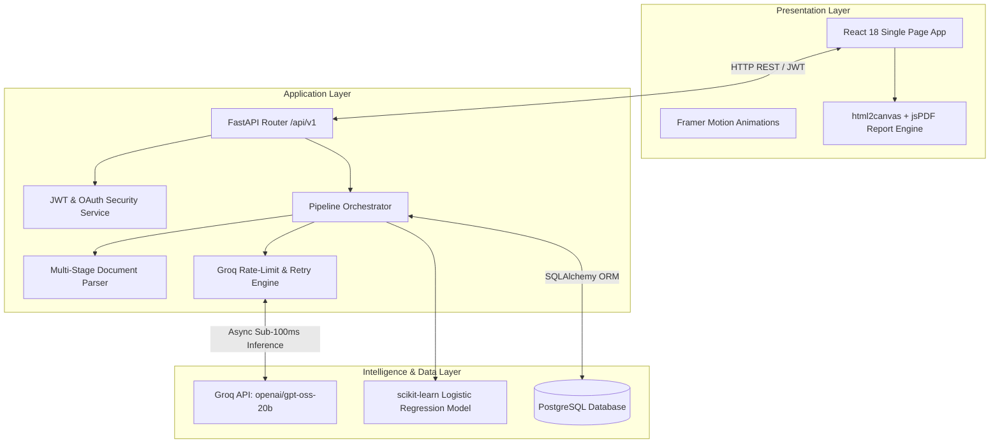
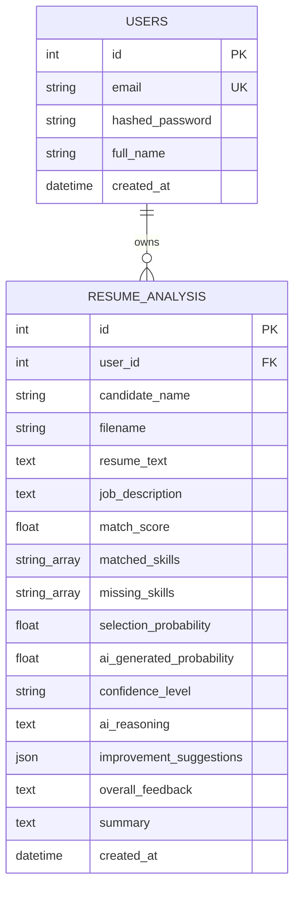

# System Architecture – ResumeXAI 2.0 🏗️

ResumeXAI 2.0 uses a modern, modular client-server architecture organized into three primary layers: **Presentation (Frontend)**, **Application (Backend APIs)**, and **Intelligence & Data (Database + ML + LLMs)**.

---

## 🏛️ High-Level System Architecture

```mermaid
graph TD
    subgraph Presentation Layer
        UI[React 18 Single Page App]
        FM[Framer Motion Animations]
        PDF[html2canvas + jsPDF Report Engine]
    end

    subgraph Application Layer
        API[FastAPI Router /api/v1]
        AUTH[JWT & OAuth Security Service]
        PARSER[Multi-Stage Document Parser]
        ORCH[Pipeline Orchestrator]
        HELPER[Groq Rate-Limit & Retry Engine]
    end

    subgraph Intelligence & Data Layer
        GROQ[Groq API: openai/gpt-oss-20b]
        ML[scikit-learn Logistic Regression Model]
        DB[(PostgreSQL Database)]
    end

    UI <-->|HTTP REST / JWT| API
    API --> AUTH
    API --> ORCH
    ORCH --> PARSER
    ORCH --> HELPER
    HELPER <-->|Async Sub-100ms Inference| GROQ
    ORCH --> ML
    ORCH <-->|SQLAlchemy ORM| DB
    UI --> PDF
```

---

## 🎨 Presentation Layer (Frontend)

- **Framework:** React 18 initialized via Vite for fast module hot-reloading.
- **Styling Engine:** Tailwind CSS with a custom Obsidian Theme (`#0b0e14` dark backgrounds, glassmorphism cards, glowing borders).
- **Animation System:** Framer Motion spring physics driving layout transitions, file dropzone scanner glows, and staggered entrance cards.
- **Client-Side PDF Generator:** Combines `html2canvas` and `jsPDF`. Features a specialized `.pdf-hide` DOM cloning technique that strips glowing blurs and CSS backdrops strictly during capture to produce clean A4 PDF reports.
- **API Interceptor:** Axios instance (`api.js`) attaching JWT Bearer tokens automatically to protected API calls.

---

## ⚙️ Application Layer (Backend APIs)

- **Framework:** FastAPI running on Uvicorn (Python 3.11+).
- **Pipeline Orchestrator (`orchestrator.py`)**: Central pipeline manager coordinating parsing, skill discovery, ML prediction, AI detection, and advice generation.
- **Groq Resilience & Retry Engine (`groq_helper.py`)**: Wraps LLM requests with automatic retries on 429 Rate Limit errors and control-character tolerant JSON parsing (`json.loads(strict=False)`).
- **Multi-Stage Document Parser (`resume_parser.py`)**:
  - `pdfplumber`: Primary PDF parser for multi-column text, tables, and custom encodings.
  - `pypdf`: Secondary PDF stream fallback.
  - `PyPDF2`: Tertiary PDF fallback.
  - `python-docx`: Microsoft Word paragraph reader.
  - `.txt` UTF-8 text reader.
- **Candidate Name Extractor**: Fast regex tokenization engine extracting full candidate names from resume headers without LLM latency.

---

## 🧠 Intelligence & Data Layer

### 1. Generative AI Engine (Groq)
- **Model:** `openai/gpt-oss-20b`
- **Inference Speed:** **< 100ms** per request.
- **Tasks:** Technical skill extraction, semantic matching, AI content detection reasoning, and executive improvement suggestions.

### 2. Machine Learning Selection Classifier
- **Model:** Logistic Regression (`selection_model.pkl` trained via `scikit-learn`).
- **Input Features:**
  - `skill_match_score`: Skill overlap percentage.
  - `skill_count`: Total matched technical competencies.
  - `years_of_experience`: Scanned experience years heuristic.
  - `education_score`: Educational qualification weight (1 to 5).
- **Output:** Shortlist selection probability percentage (`0.0%` to `100.0%`).

### 3. Database Layer (PostgreSQL)
- **ORM:** SQLAlchemy with automatic connection pooling.
- **Entity Schemas:**

```mermaid
erDiagram
    USERS ||--o{ RESUME_ANALYSIS : "owns"
    
    USERS {
        int id PK
        string email UK
        string hashed_password
        string full_name
        datetime created_at
    }

    RESUME_ANALYSIS {
        int id PK
        int user_id FK
        string candidate_name
        string filename
        text resume_text
        text job_description
        float match_score
        string_array matched_skills
        string_array missing_skills
        float selection_probability
        float ai_generated_probability
        string confidence_level
        text ai_reasoning
        json improvement_suggestions
        text overall_feedback
        text summary
        datetime created_at
    }
```

---

## 🔒 Security Architecture

1. **Password Hashing:** `passlib` utilizing `bcrypt` hashing for local user credentials.
2. **JWT Authentication:** `python-jose` generating signed HMAC-SHA256 access tokens.
3. **Google OAuth 2.0:** Server-side verification of Google ID tokens via `google-auth`.
4. **CORS Middleware:** Restricted origin policy preventing unauthorized cross-origin requests.
5. **SQL Injection Prevention:** Parameterized queries enforced via SQLAlchemy ORM.

---

## ⚡ Performance Optimization Summary

| Optimization | Method | Impact |
| :--- | :--- | :--- |
| **LLM Inference** | Switched from `groq/compound` to `openai/gpt-oss-20b` | Response time reduced from 1.5s to **<100ms** |
| **429 Rate-Limit Handling** | Async `execute_groq_call()` with exponential retries | Zero API failure fallbacks |
| **PDF Extraction** | `pdfplumber` + `pypdf` multi-stage parser | 99%+ extraction accuracy on complex layouts |
| **False-Negative Elimination** | Semantic matching + direct regex keyword verification | 0% false match score bugs eliminated |
| **Name Extraction** | Fast regex header tokenization | Saved 1 unnecessary LLM request per analysis |

---

*Architecture documentation for ResumeXAI 2.0 – Intelligent Resume Evaluation System.*
