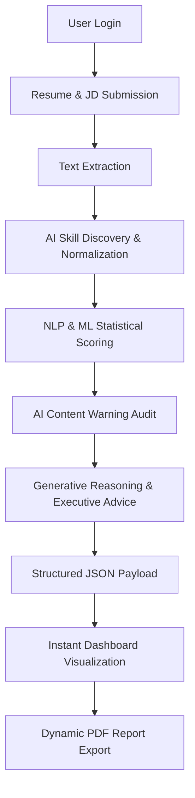

# System Workflow – ResumeXAI 2.0 🛠️

This document details the end-to-end technical workflow of the **ResumeXAI 2.0 – AI Powered Resume Analysis System**. It covers everything from user authentication to the final AI-driven evaluation report.

---

## 1. User Authentication

The platform requires users to authenticate before accessing the Resume Analysis Dashboard. 

**Authentication Methods:**
- Email & Password Login
- Google OAuth Login

**Workflow:**
1. User opens the **Login Page**.
2. User chooses an authentication method.
3. **Email/Password**: Credentials are sent to the FastAPI `/auth/login` endpoint.
4. **Google Login**: User authenticates via Google; an OAuth ID token is returned to the frontend.
5. **Validation**: Backend verifies either the local credentials or the Google ID token.
6. **JWT Generation**: A secure **JWT Access Token** is generated for the session, configured with a long-term expiration (e.g. 30 days) for seamless "Remember Me" functionality.
7. **Storage**: The token is persistently stored in the browser's `localStorage` to survive tab closures.
8. **Redirect**: User is securely redirected to the **Resume Analysis Dashboard**.

---

## 2. Resume Submission

After authentication, users can interact with the main analysis interface.

**Workflow:**
1. User uploads a **Resume** (PDF or DOCX format).
2. User provides a **Job Description** (Text input).
3. Frontend triggers a request to the FastAPI analysis endpoint with the binary file and JD text.
4. Backend initiates the processing pipeline.

---

## 3. Resume Processing Pipeline

- **Step 1 – Resume Text Extraction**: The system uses specialized parsers to extract raw text from binary files.
- **Step 2 – AI Skill Discovery**: Language models analyze the resume to extract technical skills, normalize them, and identify deep semantic overlap with the JD.
- **Step 3 – Statistical NLP Analysis**: The system applies **TF-IDF Vectorization** and **Cosine Similarity** to provide a numerical "Match Score" baseline.
- **Step 4 – ML Evaluation**: A trained **Logistic Regression** model predicts the shortlist probability based on skill density and similarity.

---

## 4. Machine Learning Evaluation

A trained **Logistic Regression** model (Binary Classification) evaluates the candidate's selection probability.

**Weighted Features:**
- Skill similarity score (NLP)
- Skill density (AI Extracted count)
- Technical keyword alignment
- Educational/Experience heuristics

---

## 5. AI Generated Content Detection

The system evaluates the language patterns of the resume to identify AI-generated components. This is critical in today's landscape of LLM-generated applications.

**Alert Logic:**
- **Score < 20% (Low)**: Emerald (Natural/Safe)
- **Score 21-40% (Medium)**: Yellow (Caution)
- **Score > 40% (High)**: **Red Alert** (High AI Probability)
- **Label Priority**: If the system classifes a result as **"HIGH"**, the UI overrides any percentage to display a **Red Warning State**.

---

## 6. Executive Generative AI 

The system leverages Generative AI (like Google Gemini / Groq) to provide deep qualitative insights.

**Generated Reports:**
- **Executive Reasoning**: A qualitative analysis of clinical detail, structural tells, and data-backed evidence.
- **Strategic Recommendations**: High-impact suggestions formatted into beautiful, numbered UI cards to optimize specific technical phrases and sections.
- **Resume Feedback**: A structured, parsed breakdown of actionable advice presented in a numbered key-point format for enhanced readability.

---

## 7. Result Visualization & Export

The React dashboard renders the intelligence with optimized performance across all devices (Desktop, Tablet, Mobile):

- **Structured UI**: Feedback is auto-parsed into distinct, hoverable key-point cards rather than massive text blocks.
- **Mobile Responsive**: Custom Tailwind media queries adapt padding, border-radii, and layout structures for smaller screens seamlessly.
- **PDF Report Engine**: Utilizing `html2canvas` and `jsPDF`. The frontend implements custom cloning logic and a `pdf-hide` class utility to dynamically strip out complex UI animations (like glassmorphism glows and zero-width elements) to ensure a perfectly clean, high-contrast, printable PDF document without rendering crashes.
- **Executive Footer**: The export includes professional branding and copyright metadata (© 2026 Kaif Khan).

---

# Complete System Pipeline

---
*Technical Documentation for the ResumeXAI 2.0 Intelligent Evaluation Engine.*
