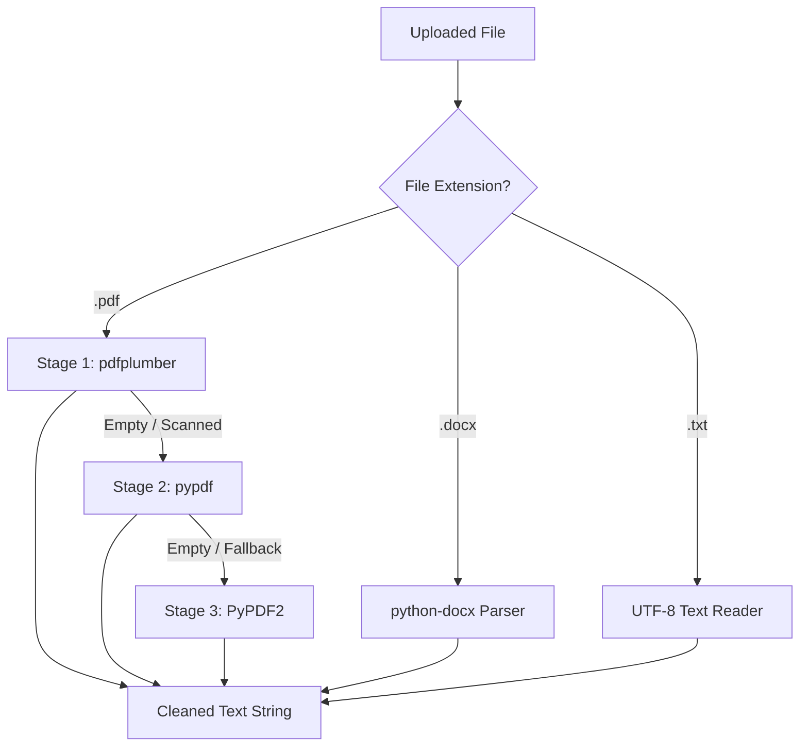
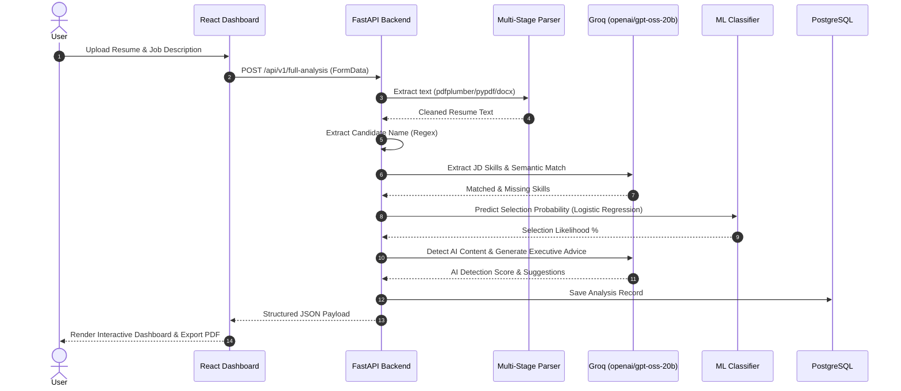

# System Workflow – ResumeXAI 2.0 🛠️

This document details the end-to-end technical workflow of **ResumeXAI 2.0**, tracking user interactions, backend processing, machine learning evaluation, and report visualization.

---

## 1. User Authentication & Authorization

Before interacting with the analysis engine, users authenticate to obtain a session token.

### Authentication Options
1. **Email & Password Authentication**: Standard form credentials checked against bcrypt password hashes in PostgreSQL.
2. **Google OAuth 2.0**: Single Click sign-in verifying Google ID tokens server-side via `google-auth`.

### Workflow
1. User submits credentials or clicks **Google Sign-In**.
2. FastAPI validates the request at `/api/v1/auth/login` or `/api/v1/auth/google`.
3. Upon validation, the backend generates a signed **JWT Access Token** (valid for 30 days).
4. The token is stored in the browser's `localStorage` and attached to all subsequent request headers via Axios interceptors.
5. User is redirected to the `/dashboard` page.

---

## 2. Document Submission & Ingestion

1. User uploads a candidate resume file (`.pdf`, `.docx`, or `.txt`) via the drag-and-drop file dropzone.
2. User provides a target **Job Description** (Text format).
3. The React frontend sends a `multipart/form-data` request to `POST /api/v1/full-analysis`.

---

## 3. Multi-Stage Document Parsing Pipeline

To ensure 100% extraction accuracy across different PDF layouts, the backend uses a multi-tier fallback parser:

```mermaid
flowchart TD
    A[Uploaded File] --> B{File Extension?}
    B -->|.pdf| C[Stage 1: pdfplumber]
    C -->|Empty / Scanned| D[Stage 2: pypdf]
    D -->|Empty / Fallback| E[Stage 3: PyPDF2]
    B -->|.docx| F[python-docx Parser]
    B -->|.txt| G[UTF-8 Text Reader]
    C & D & E & F & G --> H[Cleaned Text String]
```

1. **`pdfplumber`**: Primary PDF extractor that excels at extracting text from multi-column layouts, tables, and custom font encodings.
2. **`pypdf`**: Secondary fallback for standard PDF streams.
3. **`PyPDF2`**: Tertiary fallback.
4. **`python-docx`**: Parses Word documents paragraph by paragraph.
5. **Whitespace Cleaning**: Normalizes tabs, multiple spaces, and non-standard whitespace while preserving technical punctuation (`C++`, `.NET`, `Node.js`).

---

## 4. Candidate Name Extraction Engine

A specialized regex text-processing service extracts the candidate's full name from the document header without wasting LLM API calls:

1. Tokenizes early text chunks up to contact boundaries (`Email:`, `@`, `Phone:`, `LinkedIn`, `GitHub`, numbers).
2. Filters out section titles (`Resume`, `Curriculum Vitae`, `Summary`, `Experience`).
3. Formats tokens into proper Title Case (e.g., `KAIF KHAN` ➔ `Kaif Khan`).

---

## 5. AI Skill Discovery & Semantic Matching

1. **Target JD Skill Extraction**: Groq LLM (`openai/gpt-oss-20b`) extracts essential technical skills, tools, and frameworks from the Job Description.
2. **Semantic Matching**: Groq LLM evaluates the candidate's experience against JD skills, recognizing equivalents and synonyms (e.g., `PostgreSQL` ↔ `MySQL`, `FastAPI` ↔ `REST APIs`).
3. **Direct Keyword & Regex Verification (Safety Layer)**: Case-insensitive word-boundary regex checks verify skill presence in raw text to eliminate false negatives.

---

## 6. Machine Learning Selection Probability Model

A trained **Logistic Regression Classifier** (`selection_model.pkl`) predicts candidate shortlist probability based on four numerical features:

$$\text{Features} = \begin{bmatrix} \text{Skill Match Score (\%)} \\ \text{Skill Count} \\ \text{Years of Experience} \\ \text{Education Score (1-5)} \end{bmatrix}$$

- **Experience Heuristic**: Scans text for patterns (`5+ years`, `3 yrs experience`).
- **Education Heuristic**: Scores degree level (`PhD/Master` = 5, `Bachelor/BTech/BCA` = 3, `Other` = 1).
- Output probability is rounded to 2 decimal places and mapped to *Low*, *Medium*, or *High* likelihood.

---

## 7. AI Content Detection & Authenticity Audit

Evaluates linguistic structures to estimate the probability that the resume was generated by an AI tool (ChatGPT, Gemini):

- **Structural Tell Inspection**: Checks for identical bullet lengths, repetitive transition words, and generic summaries.
- **Classification Thresholds**:
  - `0% - 20%`: **Low AI Risk** (Green Badge)
  - `21% - 40%`: **Medium AI Risk** (Yellow Badge)
  - `> 40%`: **High AI Risk** (Red Badge & Warning Alert)

---

## 8. Executive Resume Advisor & Feedback Generation

Groq (`openai/gpt-oss-20b`) generates deep qualitative evaluation reports:

1. **6 Actionable Improvement Suggestions**: Specific, section-by-section advice on phrasing, technologies, and achievements to add.
2. **Executive Feedback Paragraphs**: In-depth narrative reviewing candidate strengths, critical gaps, and narrative impact.
3. **Rate Limit & JSON Resilience**: Calls use `execute_groq_call()` with automatic 429 rate limit retries and control-character tolerant JSON parsing (`json.loads(strict=False)`).

---

## 9. Result Visualization & PDF Export

1. **Dashboard Rendering**: React parses the structured JSON payload into glassmorphic metric cards, skill tag clouds, and feedback accordions.
2. **Database Persistence**: Saves analysis results to PostgreSQL (`resume_analyses` table).
3. **Print-Optimized PDF Export**:
   - `html2canvas` captures `#report-content`.
   - `.pdf-hide` CSS classes temporarily hide decorative animations and glowing blurs.
   - `jsPDF` compiles a clean, print-ready A4 document.

---

## 🔁 Complete System Workflow Diagram

```mermaid
sequenceDiagram
    autonumber
    actor User
    participant Frontend as React Dashboard
    participant API as FastAPI Backend
    participant Parser as Multi-Stage Parser
    participant LLM as Groq (openai/gpt-oss-20b)
    participant ML as ML Classifier
    participant DB as PostgreSQL

    User->>Frontend: Upload Resume & Job Description
    Frontend->>API: POST /api/v1/full-analysis (FormData)
    API->>Parser: Extract text (pdfplumber/pypdf/docx)
    Parser-->>API: Cleaned Resume Text
    API->>API: Extract Candidate Name (Regex)
    API->>LLM: Extract JD Skills & Semantic Match
    LLM-->>API: Matched & Missing Skills
    API->>ML: Predict Selection Probability (Logistic Regression)
    ML-->>API: Selection Likelihood %
    API->>LLM: Detect AI Content & Generate Executive Advice
    LLM-->>API: AI Detection Score & Suggestions
    API->>DB: Save Analysis Record
    API-->>Frontend: Structured JSON Payload
    Frontend-->>User: Render Interactive Dashboard & Export PDF
```
